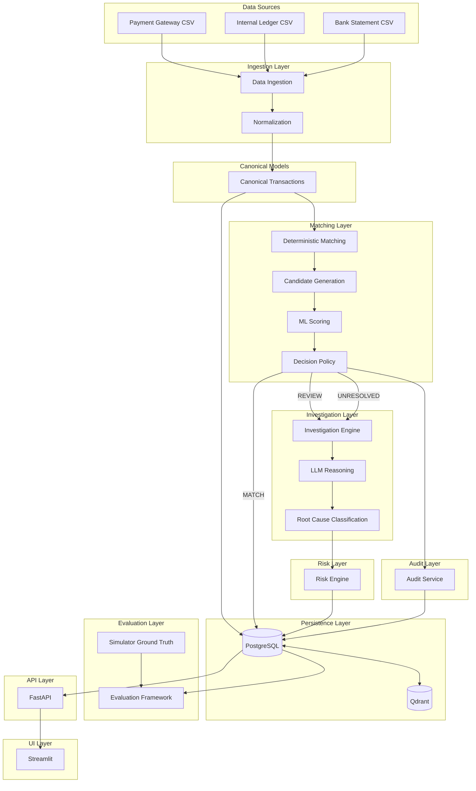
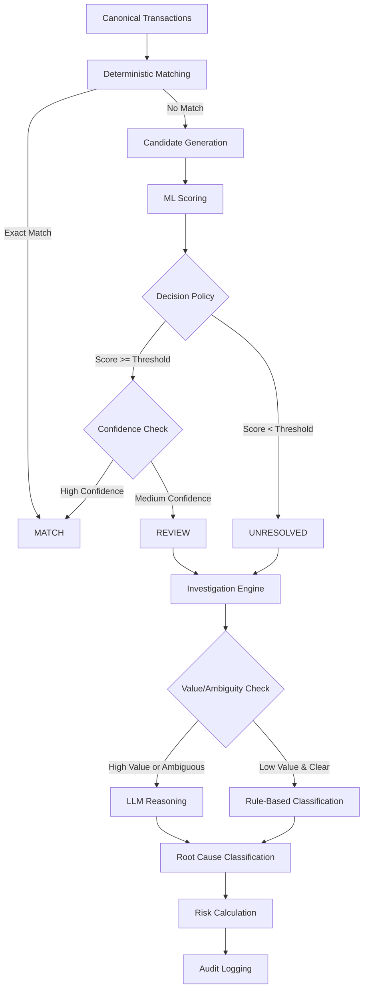
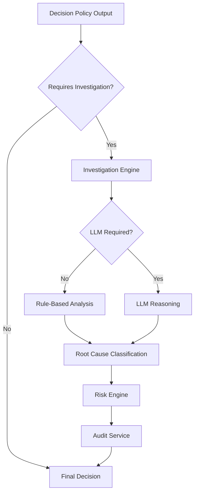
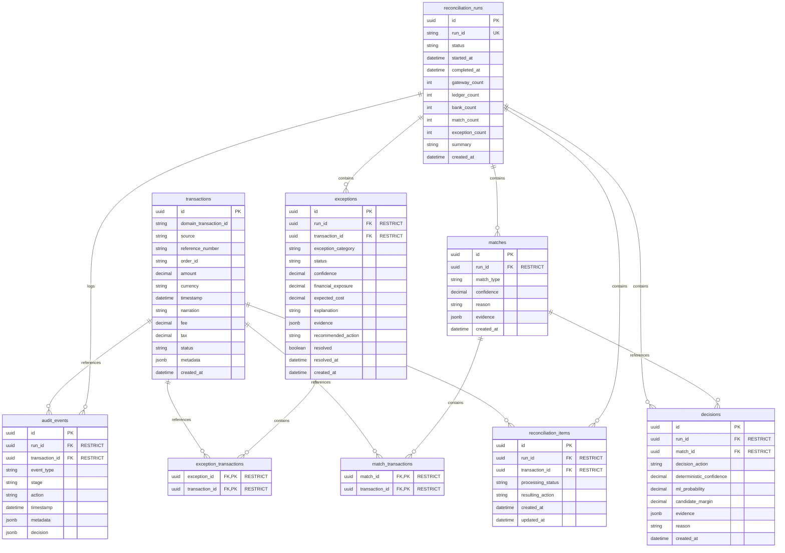

# Architecture Documentation

## Project Purpose

Project Sentinel is an AI-assisted financial reconciliation and investigation system that reconciles:
1. Payment gateway settlement data
2. Internal order/payment ledger
3. Bank statement

**Design Priorities:**
- Correctness
- Financial safety
- Explainability
- Auditability
- Calibrated confidence
- Deterministic verification
- Selective ML/LLM use
- Low inference cost

**What This System Is NOT:**
- A generic chatbot
- A conversational AI for general queries
- A system that relies on LLMs for core financial decisions

## System Architecture Diagram



## Reconciliation Data Flow

```mermaid
graph LR
    A[Gateway/Ledger/Bank CSV] --> B[Data Ingestion]
    B --> C[Normalization]
    C --> D[Canonical Transactions]
    D --> E[Persistence - PostgreSQL]
    D --> F[Deterministic Matching]
    F --> G[Candidate Generation]
    G --> H[ML Scoring]
    H --> I[Decision Policy]
    I -->|MATCH| J[Match Record]
    I -->|REVIEW| K[Investigation Required]
    I -->|UNRESOLVED| K
    K --> L[Investigation Engine]
    L -->|Ambiguous/High Value| M[LLM Reasoning]
    M --> N[Root Cause Classification]
    N --> O[Risk Engine]
    O --> P[Audit Result]
    J --> E
    P --> E
```



## Decision Flow



## Investigation Flow



## Persistence Architecture

```mermaid
graph TB
    subgraph PostgreSQL[(PostgreSQL - System of Record)]
        RR[reconciliation_runs]
        SR[source_records]
        MT[matches]
        DC[decisions]
        EX[exceptions]
        AE[audit_events]
        IR[investigation_records]
    end
    
    subgraph Qdrant[(Qdrant - Auxiliary Retrieval)]
        IK[Investigation Knowledge]
        HE[Historical Exceptions]
        SE[Semantic Evidence]
    end
    
    CT[Canonical Transactions] --> RR
    RR --> SR
    SR --> MT
    MT --> DC
    DC --> EX
    DC --> AE
    EX --> IR
    IR <--> Qdrant
```

## Component Responsibilities

### Data Ingestion
- **Responsibility**: Read CSV files from payment gateway, internal ledger, and bank statement
- **Inputs**: CSV file paths
- **Outputs**: Raw data frames
- **Dependencies**: pandas
- **Must NOT Do**: Validation, normalization, transformation

### Normalization
- **Responsibility**: Transform raw data into canonical format, handle field mapping, currency conversion
- **Inputs**: Raw data frames
- **Outputs**: Canonical transaction objects
- **Dependencies**: Canonical models, currency conversion utilities
- **Must NOT Do**: Matching, persistence, business logic

### Canonical Models
- **Responsibility**: Define Pydantic models for canonical transactions, matches, decisions
- **Inputs**: N/A (schema definitions)
- **Outputs**: Type-safe data structures
- **Dependencies**: Pydantic
- **Must NOT Do**: Business logic, persistence, matching logic

### Deterministic Matching
- **Responsibility**: Apply exact matching rules based on amount, date, identifiers
- **Inputs**: Canonical transactions
- **Outputs**: Exact matches
- **Dependencies**: Canonical models
- **Must NOT Do**: LLM calls, database queries, ML inference

### Candidate Generation
- **Responsibility**: Generate potential match candidates using fuzzy rules
- **Inputs**: Unmatched canonical transactions
- **Outputs**: Candidate match pairs
- **Dependencies**: Canonical models, fuzzy matching utilities
- **Must NOT Do**: LLM calls, database queries, final decisions

### ML Scoring
- **Responsibility**: Score candidate matches using trained ML models
- **Inputs**: Candidate match pairs
- **Outputs**: Match probabilities and confidence scores
- **Dependencies**: ML models, feature engineering
- **Must NOT Do**: LLM calls, database queries, final decisions

### Decision Policy
- **Responsibility**: Apply threshold-based rules to determine match/review/unresolved status
- **Inputs**: ML scores, deterministic matches
- **Outputs**: Decisions (MATCH/REVIEW/UNRESOLVED)
- **Dependencies**: ML scoring, configuration
- **Must NOT Do**: LLM calls, database mutations, investigation logic

### Reconciliation Orchestrator
- **Responsibility**: Coordinate the end-to-end reconciliation pipeline with persistence
- **Inputs**: Normalized transactions grouped by source, run ID
- **Outputs**: ReconciliationSummary with execution results
- **Dependencies**: TransactionRepository, ReconciliationRepository, MatchRepository, DecisionRepository, ExceptionRepository, AuditRepository, DeterministicMatcher, MLScorer (optional), DecisionPolicy
- **Must NOT Do**: CSV parsing, ML training, direct database queries (use repositories), API logic

### PostgreSQL
- **Responsibility**: SYSTEM OF RECORD for all structured financial state
- **Inputs**: Structured data from pipeline
- **Outputs**: Query results, transactional guarantees
- **Dependencies**: Database schema
- **Must NOT Do**: Business logic, matching, ML inference

### Audit Service
- **Responsibility**: Log all state changes, decisions, and evidence
- **Inputs**: Decisions, matches, investigations
- **Outputs**: Audit trail records
- **Dependencies**: PostgreSQL
- **Must NOT Do**: Business logic, decision making

### Investigation Engine
- **Responsibility**: Coordinate investigation workflows for unresolved cases
- **Inputs**: Unresolved decisions, review cases
- **Outputs**: Investigation results
- **Dependencies**: LLM reasoning, rule-based analysis
- **Must NOT Do**: Direct financial record mutations

### LLM Reasoning
- **Responsibility**: Provide structured reasoning for ambiguous or high-value cases
- **Inputs**: Investigation context, transaction data
- **Outputs**: Structured analysis (validated)
- **Dependencies**: LLM API, validation schemas
- **Must NOT Do**: Direct financial record mutations, unstructured output

### Root Cause Classification
- **Responsibility**: Classify the root cause of reconciliation exceptions
- **Inputs**: Investigation results, LLM analysis
- **Outputs**: Root cause categories
- **Dependencies**: Classification models or rules
- **Must NOT Do**: Financial record mutations

### Risk Engine
- **Responsibility**: Calculate financial risk and expected cost of decisions
- **Inputs**: Decisions, root causes, transaction amounts
- **Outputs**: Risk scores, expected cost
- **Dependencies**: Financial calculations
- **Must NOT Do**: Decision making, record mutations

### FastAPI
- **Responsibility**: Expose REST API endpoints for reconciliation operations
- **Inputs**: HTTP requests
- **Outputs**: HTTP responses
- **Dependencies**: Backend services
- **Must NOT Do**: Business logic, direct database access (use services)

### Streamlit
- **Responsibility**: Provide web UI for reconciliation monitoring and investigation
- **Inputs**: User interactions
- **Outputs**: Visualizations, forms
- **Dependencies**: FastAPI
- **Must NOT Do**: Business logic, direct database access

### Evaluation Framework
- **Responsibility**: Evaluate reconciliation quality against ground truth
- **Inputs**: Reconciliation results, ground truth
- **Outputs**: Metrics (precision, recall, etc.)
- **Dependencies**: Simulator, metrics calculation
- **Must NOT Do**: Production data mutations

## Database Architecture

### PostgreSQL as System of Record

**PostgreSQL is the authoritative source of truth for all structured financial state.**

**Planned Entities:**

#### reconciliation_runs
- **Purpose**: Track each reconciliation execution
- **Fields**: run_id, timestamp, data_sources, status, summary_stats
- **Relationships**: One-to-many with source_records, matches, decisions

#### source_records
- **Purpose**: Store individual source transactions
- **Fields**: record_id, source_type (gateway/ledger/bank), canonical_data, run_id
- **Relationships**: Many-to-one with reconciliation_runs, many-to-many with matches

#### matches
- **Purpose**: Store matched transaction groups
- **Fields**: match_id, match_type (deterministic/ml), confidence, evidence, run_id
- **Relationships**: Many-to-one with reconciliation_runs, many-to-many with source_records

#### decisions
- **Purpose**: Store final decisions for each match or exception
- **Fields**: decision_id, match_id, decision (match/review/unresolved), reason, confidence, run_id
- **Relationships**: Many-to-one with reconciliation_runs, many-to-one with matches

#### exceptions
- **Purpose**: Store unresolved or exceptional cases
- **Fields**: exception_id, type, severity, description, investigation_status, run_id
- **Relationships**: Many-to-one with reconciliation_runs

#### audit_events
- **Purpose**: Log all state changes for audit trail
- **Fields**: event_id, timestamp, entity_type, entity_id, action, actor, previous_state, new_state
- **Relationships**: References all entities

#### investigation_records
- **Purpose**: Store investigation workflow results
- **Fields**: investigation_id, exception_id, method (llm/rule-based), result, root_cause, risk_score, timestamp
- **Relationships**: Many-to-one with exceptions

**Constraints:**
- All financial amounts stored as DECIMAL type
- Foreign key constraints enforced
- Immutable audit events (append-only)
- Canonical data stored as JSONB with validation

### Relational Schema (Implemented)



**Key Design Decisions:**
- Unique constraint on (source, domain_transaction_id) for transactions to prevent duplicates
- N:M junction tables (match_transactions, exception_transactions) for proper many-to-many relationships
- RESTRICT for all foreign keys (no cascade delete) to prevent accidental data loss
- Decimal type for all financial values to ensure precision
- JSONB for flexible fields (evidence, metadata) that may vary per record
- Indexes on frequently queried fields (run_id, transaction_id, timestamps, etc.)

### Qdrant Boundary

**Qdrant is NOT a source of truth for financial data.**

**Planned Use Cases:**
- Investigation knowledge base (historical case retrieval)
- Semantic retrieval of evidence for investigations
- Exception pattern similarity search

**Explicit Boundaries:**
- NOT required for core reconciliation path
- NOT used for deterministic matching
- NOT used for financial state storage
- Results from Qdrant are advisory only, not authoritative

## LLM Boundary

**Prominent Rule: LLM MUST NOT be used for every transaction.**

**Target Flow:**
```
Deterministic → ML → Decision → Only unresolved/high-value/ambiguous → Investigation → LLM
```

**LLM Usage Constraints:**
- LLM must not directly mutate financial records
- LLM outputs must be structured and validated against Pydantic schemas
- LLM calls are gated by decision policy (only for REVIEW/UNRESOLVED cases)
- LLM is used for explanation and investigation, not for matching
- LLM reasoning is not authoritative financial truth

**When LLM IS Used:**
- High-value ambiguous cases
- Complex exception patterns
- Investigation requiring semantic understanding
- Root cause classification for novel patterns

**When LLM is NOT Used:**
- Deterministic matching
- Candidate generation
- ML scoring
- Threshold-based decisions
- Routine exception classification

## Financial Safety Principles

1. **Decimal for monetary calculations**: Never use floating point for financial state
2. **Never force ambiguous match**: When uncertain, escalate rather than guess
3. **ML probability is not certainty**: High ML score ≠ guaranteed match
4. **LLM reasoning is not authoritative**: LLM outputs require validation
5. **Deterministic evidence has priority**: Exact matches override ML/LLM suggestions
6. **Every automated decision must have evidence**: Audit trail required
7. **Every important state change must be auditable**: No silent mutations
8. **Uncertain cases must be escalated**: Better to leave unresolved than to incorrectly match

**False Positive Prevention:**
- False positive financial matches are more dangerous than unresolved cases
- Decision thresholds should be conservative
- High-value transactions require higher confidence

## Data Flow

**Complete Intended Flow:**

```
Gateway/Ledger/Bank CSV
  → Data Ingestion
  → Normalization
  → Canonical Transactions
  → Persistence (PostgreSQL)
  → Deterministic Matching
  → Candidate Generation
  → ML Scoring
  → Decision Policy
  → MATCH/REVIEW/UNRESOLVED
  → Investigation (if REVIEW/UNRESOLVED)
  → LLM (if high-value/ambiguous)
  → Root Cause Classification
  → Risk Engine
  → Audit Service
  → Final Result
```

## Evaluation Architecture

**Ground Truth Usage:**
- Simulator ground truth used ONLY for evaluation/training-data generation
- Ground truth must NOT be treated as runtime truth
- Production reconciliation does not depend on simulator

**Evaluation Dimensions:**
- Precision (correct matches / total matches)
- Recall (correct matches / total true matches)
- False match rate (incorrect matches / total matches)
- Unresolved rate (unresolved / total transactions)
- Calibration (predicted confidence vs actual correctness)
- Exception classification accuracy
- Financial exposure incorrectly matched
- Investigation accuracy
- Cost-weighted error
- Latency
- LLM invocation rate (should be low)

**Emphasis:**
- False positive financial matches are more dangerous than unresolved cases
- Evaluation metrics should reflect this risk asymmetry

## Architecture Invariants

**Rules:**

1. Do not bypass canonical models
2. Do not put database code into matching algorithms
3. Do not put API logic into business logic
4. Do not put Streamlit logic into backend services
5. Do not make LLM calls from deterministic matching
6. Do not make LLM calls for every transaction
7. Do not replace deterministic rules with an LLM
8. Do not use Qdrant as a financial system of record
9. Do not silently change decision thresholds
10. Do not introduce new architecture without updating this document
11. Do not introduce dependencies without justification
12. Preserve existing working components unless a real defect requires change

## Current Implementation Status

### IMPLEMENTED

- Repository foundation
- Canonical Pydantic models
- Synthetic financial data simulator
- Ground truth generation
- Normalization
- Deterministic candidate generation
- Deterministic matching
- ML feature engineering
- Logistic Regression baseline
- XGBoost candidate scoring
- Decision policy
- Financial consistency utility
- PostgreSQL persistence layer
- Reconciliation orchestrator service
- Tests for the above

### NOT YET IMPLEMENTED

- Evaluation engine
- Investigation engine
- LLM reasoning
- Root-cause agent
- Risk engine
- Audit service integration
- FastAPI
- Streamlit
- Production deployment
