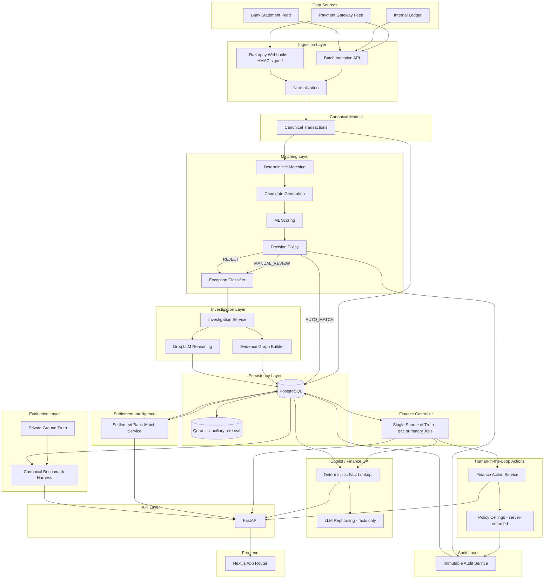
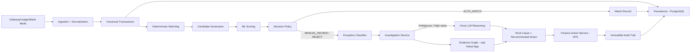
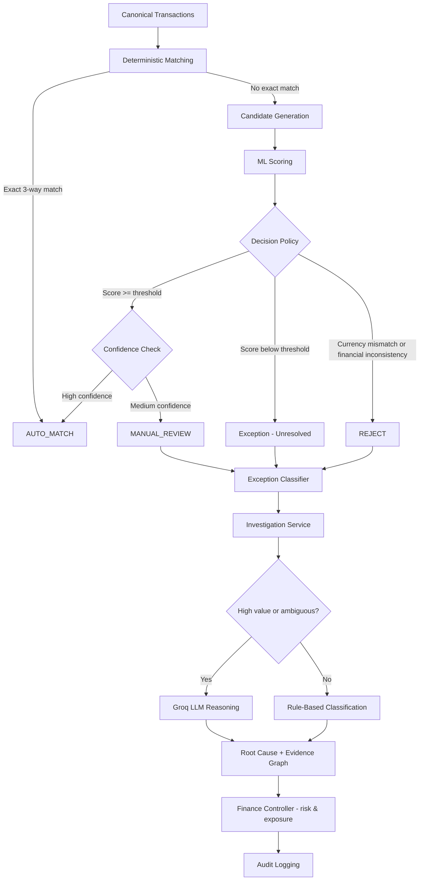
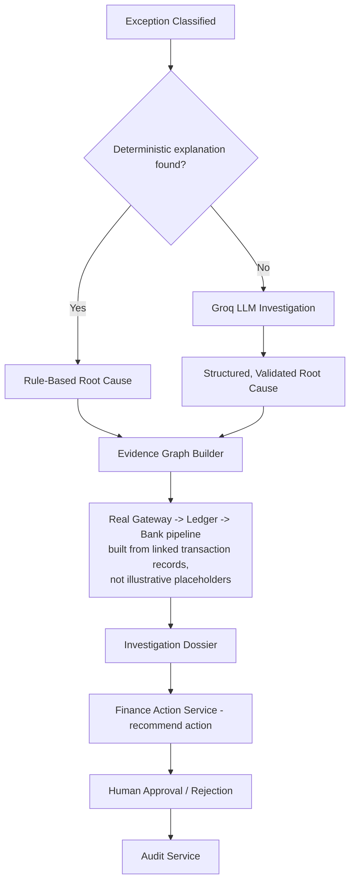
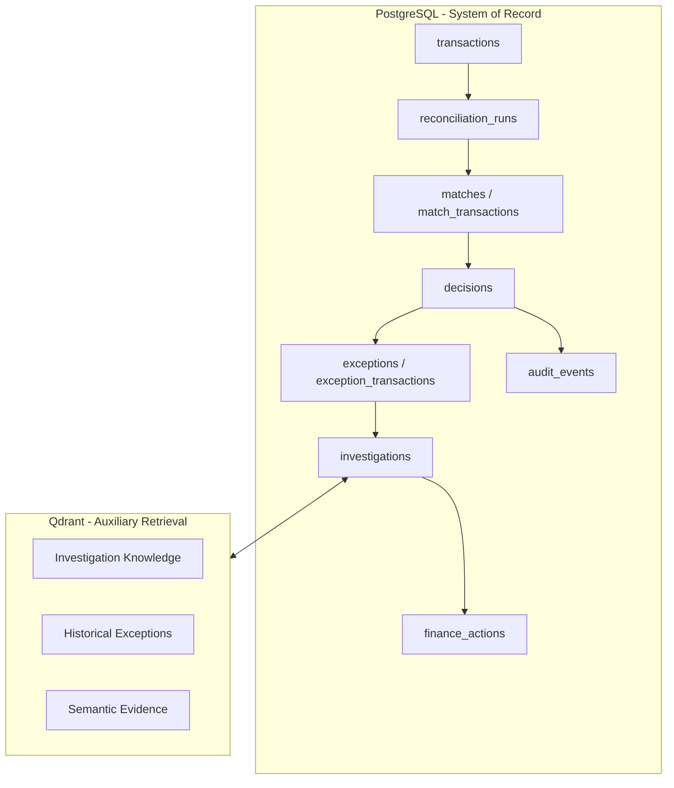
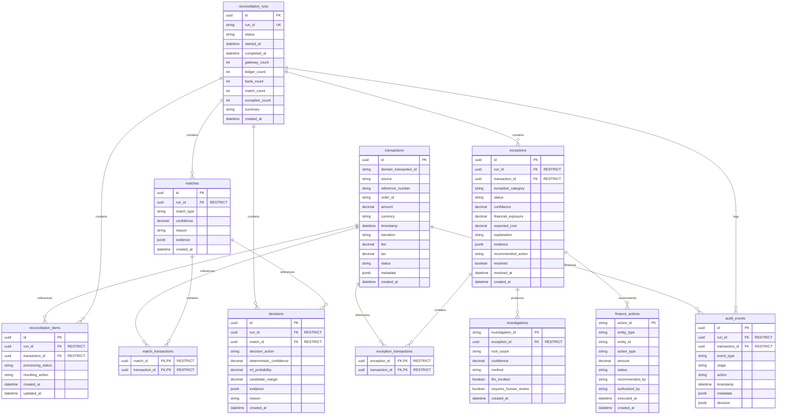

# Architecture Documentation

## Project Purpose

VERIDEX is an AI-assisted financial reconciliation, investigation, and control system that reconciles three fragmented data sources:
1. Payment gateway settlement data (Razorpay feeds & signed webhooks)
2. Internal order/payment ledger
3. Bank statement feed

**Design Priorities:**
- Correctness
- Financial safety
- Explainability
- Auditability
- Calibrated confidence
- Deterministic verification
- Selective ML/LLM use
- Low inference cost

**What This System Is NOT:**
- A system that relies on LLMs for core financial decisions
- A system that lets an LLM mutate financial records directly
- A generic conversational AI with no grounding — the Copilot chat interface computes real answers from the live database first and only uses an LLM to phrase the response

## System Architecture Diagram



## Reconciliation Data Flow



## Decision Flow



## Investigation Flow



## Persistence Architecture



## Component Responsibilities

### Data Ingestion
- **Responsibility**: Accept Gateway/Ledger/Bank records via batch ingestion API or signed Razorpay webhooks
- **Inputs**: Batch payloads, HMAC-signed webhook events
- **Outputs**: Raw records ready for normalization
- **Must NOT Do**: Validation logic beyond schema shape, matching, business decisions

### Normalization
- **Responsibility**: Transform raw records into canonical transaction format, handle field mapping and currency
- **Inputs**: Raw ingested records
- **Outputs**: Canonical transaction objects
- **Must NOT Do**: Matching, persistence side effects beyond normalization, business logic

### Canonical Models
- **Responsibility**: Pydantic models for canonical transactions, matches, decisions, exceptions
- **Must NOT Do**: Business logic, persistence, matching logic

### Deterministic Matcher (`app/matching/deterministic.py`)
- **Responsibility**: Exact 3-way matching by ID, amount, and date across Gateway/Ledger/Bank
- **Must NOT Do**: LLM calls, ML inference, final routing decisions

### ML Scorer (`app/matching/ml_scorer.py`)
- **Responsibility**: Score ambiguous candidate matches the deterministic matcher couldn't resolve
- **Must NOT Do**: LLM calls, database queries, final decisions

### Decision Policy (`app/matching/decision.py`)
- **Responsibility**: Apply financial-consistency and threshold rules to route each pair to AUTO_MATCH, MANUAL_REVIEW, or REJECT
- **Must NOT Do**: LLM calls, database mutations, investigation logic

### Exception Classifier (`app/matching/exception_classifier.py`)
- **Responsibility**: Categorize every unresolved record by root-cause type (missing bank/ledger leg, timing lag, fee/tax mismatch, duplicate, amount mismatch) instead of a generic "unresolved" bucket
- **Must NOT Do**: Financial record mutations

### Reconciliation Service (`app/services/reconciliation.py`)
- **Responsibility**: Coordinate the end-to-end reconciliation pipeline with persistence, pairing the correct transaction legs (gateway/bank preferred pairing) before invoking the decision policy
- **Must NOT Do**: CSV/payload parsing, ML training, API logic

### Investigation Service (`app/investigation/service.py`)
- **Responsibility**: Run LLM-assisted root-cause investigation per exception, and build the real evidence-graph pipeline (Gateway → Ledger → Bank) from the transactions actually linked to that exception via the `exception_transactions` join table — never illustrative placeholder data
- **Must NOT Do**: Direct financial record mutations, unstructured/unvalidated LLM output

### Finance Controller (`app/services/finance_controller.py`)
- **Responsibility**: Single source of truth for every KPI shown anywhere in the system (`get_summary_kpis`) — match rate, exceptions, exposure, aging. Every dashboard, the benchmark panel, and Copilot answers all read from this one computation, never from independently-derived per-page numbers
- **Must NOT Do**: Presentation logic, direct HTTP handling

### Finance Action Service (`app/services/finance_action_service.py`)
- **Responsibility**: Human-in-the-loop action lifecycle — Pending Approval → Approved → Executed, or → Rejected — with policy ceilings enforced server-side (max single adjustment, max write-off limit)
- **Must NOT Do**: Execute an action without human approval; bypass policy ceilings

### Settlement Intelligence Service (`app/services/razorpay_settlement_intelligence_service.py`)
- **Responsibility**: Match what the gateway reports as settled (gross, fee, tax, expected net) against the real bank credit, by UTR/reference-number lookup — the same live lookup powers both the settlement list and detail views
- **Must NOT Do**: Report a bank match that hasn't been verified against an actual bank transaction record

### Copilot / Finance QA Service (`app/services/copilot_service.py`, `app/services/finance_qa.py`)
- **Responsibility**: Answer natural-language questions two ways — (1) live-data questions, computed deterministically from the database first, LLM only rephrases the verified fact; (2) "how does this product work" questions, answered from a fixed knowledge base, LLM only rephrases
- **Must NOT Do**: Invent a number not backed by a deterministic query

### Audit Service
- **Responsibility**: Log every match, decision, action, and investigation event — immutable, append-only
- **Must NOT Do**: Business logic, decision making

### FastAPI (API Layer)
- **Responsibility**: Expose REST endpoints for reconciliation, exceptions, investigations, actions, settlements, webhooks, and copilot
- **Must NOT Do**: Business logic, direct database access (use services)

### Frontend (Next.js App Router)
- **Responsibility**: Present the Control Center, Reconciliation dashboard, Exception dossiers, Settlements, Review Actions, Benchmark, and Copilot chat — all reading from the same API layer, none computing its own numbers independently
- **Must NOT Do**: Business logic, direct database access

### Evaluation Harness (`eval/`)
- **Responsibility**: Score reconciliation quality against a private, seed-based ground truth — kept fully separate from live usage so its numbers stay reproducible and untouched by demo data
- **Must NOT Do**: Read or write production data; be modified to make a demo look better

## Database Architecture

### PostgreSQL as System of Record

**PostgreSQL is the authoritative source of truth for all structured financial state.**

### Relational Schema (Implemented)



**Key Design Decisions:**
- Unique constraint on (source, domain_transaction_id) for transactions to prevent duplicates
- N:M junction tables (match_transactions, exception_transactions) for proper many-to-many relationships
- RESTRICT for all foreign keys (no cascade delete) to prevent accidental data loss
- Decimal type for all financial values to ensure precision
- JSONB for flexible fields (evidence, metadata) that may vary per record
- Indexes on frequently queried fields (run_id, transaction_id, timestamps, etc.)

### Qdrant Boundary

**Qdrant is NOT a source of truth for financial data.**

**Use Cases:**
- Investigation knowledge base (historical case retrieval)
- Semantic retrieval of evidence for investigations
- Exception pattern similarity search

**Explicit Boundaries:**
- NOT required for core reconciliation path
- NOT used for deterministic matching
- NOT used for financial state storage
- Results from Qdrant are advisory only, not authoritative

## LLM Boundary

**Prominent Rule: LLM MUST NOT be used for every transaction.**

**Target Flow:**
```
Deterministic → ML → Decision → Only unresolved/high-value/ambiguous → Investigation → LLM
```

**LLM Usage Constraints:**
- LLM must not directly mutate financial records
- LLM outputs must be structured and validated against Pydantic schemas
- LLM calls are gated by decision policy (only for REVIEW/UNRESOLVED cases) and by the Copilot's deterministic-fact-first design
- LLM is used for explanation, investigation, and rephrasing verified facts — never for matching
- LLM reasoning is not authoritative financial truth

**When LLM IS Used:**
- Per-exception root-cause investigation
- Copilot answer phrasing (after the real fact is computed)
- "How does this product work" knowledge answers (phrasing only, over a fixed knowledge base)

**When LLM is NOT Used:**
- Deterministic matching
- Candidate generation
- ML scoring
- Threshold-based decisions
- Evidence-graph construction (built directly from linked transaction records)

## Financial Safety Principles

1. **Decimal for monetary calculations**: Never use floating point for financial state
2. **Never force ambiguous match**: When uncertain, escalate rather than guess
3. **ML probability is not certainty**: High ML score ≠ guaranteed match
4. **LLM reasoning is not authoritative**: LLM outputs require validation
5. **Deterministic evidence has priority**: Exact matches override ML/LLM suggestions
6. **Every automated decision must have evidence**: Audit trail required
7. **Every important state change must be auditable**: No silent mutations
8. **Uncertain cases must be escalated**: Better to leave unresolved than to incorrectly match
9. **Every financial action requires human authorization**: No autonomous execution, ever
10. **Single source of truth**: Every displayed number is derived from one computation layer (`get_summary_kpis`), never independently recomputed per page

**False Positive Prevention:**
- False positive financial matches are more dangerous than unresolved cases
- Decision thresholds should be conservative
- High-value transactions require higher confidence

## Data Flow

**Complete Flow:**

```
Gateway/Ledger/Bank feeds (batch ingest or signed webhooks)
  → Normalization
  → Canonical Transactions
  → Persistence (PostgreSQL)
  → Deterministic Matching
  → Candidate Generation
  → ML Scoring
  → Decision Policy
  → AUTO_MATCH / MANUAL_REVIEW / REJECT
  → Exception Classifier (if not AUTO_MATCH)
  → Investigation Service (LLM-assisted root cause + evidence graph)
  → Finance Controller (risk, exposure, single-source KPIs)
  → Finance Action Service (human-authorized corrective action)
  → Immutable Audit Trail
  → Final Result, surfaced identically across every frontend page
```

## Evaluation Architecture

**Ground Truth Usage:**
- Private, seed-based ground truth used ONLY for the canonical benchmark harness under `eval/`
- Ground truth must NOT be treated as runtime truth
- Live reconciliation runs do not depend on the evaluation harness, and the harness is never modified to make a demo look better

**Evaluation Dimensions:**
- Precision (correct matches / total matches)
- Recall (correct matches / total true matches)
- False match rate (incorrect matches / total matches)
- Unresolved rate (unresolved / total transactions)
- Calibration (predicted confidence vs actual correctness)
- Exception classification accuracy
- Financial exposure incorrectly matched
- Investigation accuracy
- Cost-weighted error
- Latency
- LLM invocation rate (should be low)

**Emphasis:**
- False positive financial matches are more dangerous than unresolved cases
- Evaluation metrics should reflect this risk asymmetry

## Architecture Invariants

**Rules:**

1. Do not bypass canonical models
2. Do not put database code into matching algorithms
3. Do not put API logic into business logic
4. Do not put frontend presentation logic into backend services
5. Do not make LLM calls from deterministic matching
6. Do not make LLM calls for every transaction
7. Do not replace deterministic rules with an LLM
8. Do not use Qdrant as a financial system of record
9. Do not silently change decision thresholds
10. Do not introduce new architecture without updating this document
11. Do not introduce dependencies without justification
12. Preserve existing working components unless a real defect requires change
13. Never let a page compute its own KPI independently of the Finance Controller
14. Never modify the canonical evaluation harness (`eval/`) to inflate a benchmark score

## Current Implementation Status

### Implemented

- Canonical Pydantic models and repository layer
- Synthetic financial data simulator and ground truth generation
- Normalization, deterministic candidate generation, deterministic 3-way matching
- ML feature engineering, Logistic Regression baseline, XGBoost candidate scoring
- Decision policy with financial-consistency checks
- PostgreSQL persistence layer (async SQLAlchemy + Alembic migrations)
- Reconciliation orchestrator service
- Exception classification by root-cause category
- LLM-assisted investigation service with real evidence-graph construction
- Finance Controller as single source of truth for all KPIs
- Human-in-the-loop Finance Action Service with policy ceilings and audit trail
- Razorpay signed-webhook ingestion and Settlement Intelligence Service
- Copilot / Finance QA service (live-data + product-knowledge modes)
- FastAPI backend exposing all of the above
- Next.js frontend (Control Center, Reconciliation, Exceptions, Settlements, Actions, Benchmark, Copilot)
- Canonical benchmark evaluation harness against private ground truth
- Full test suite covering the above
