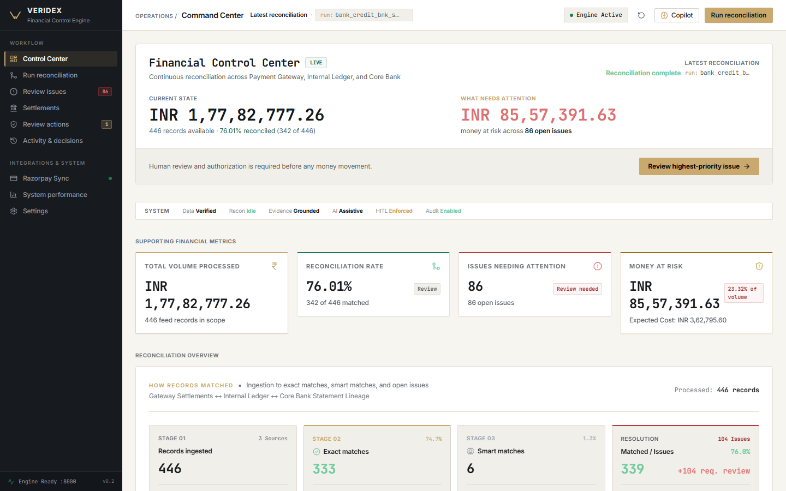
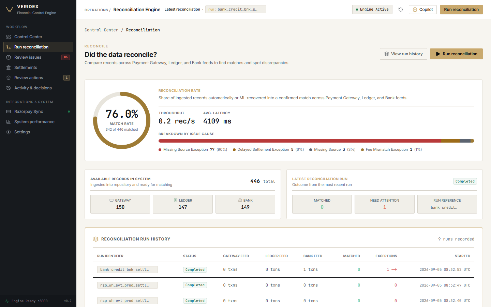
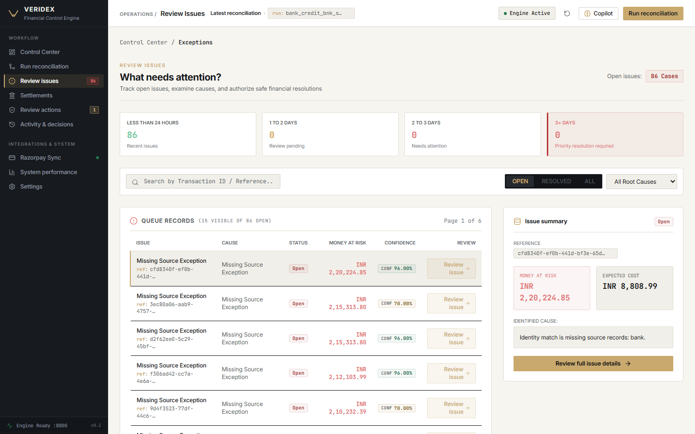
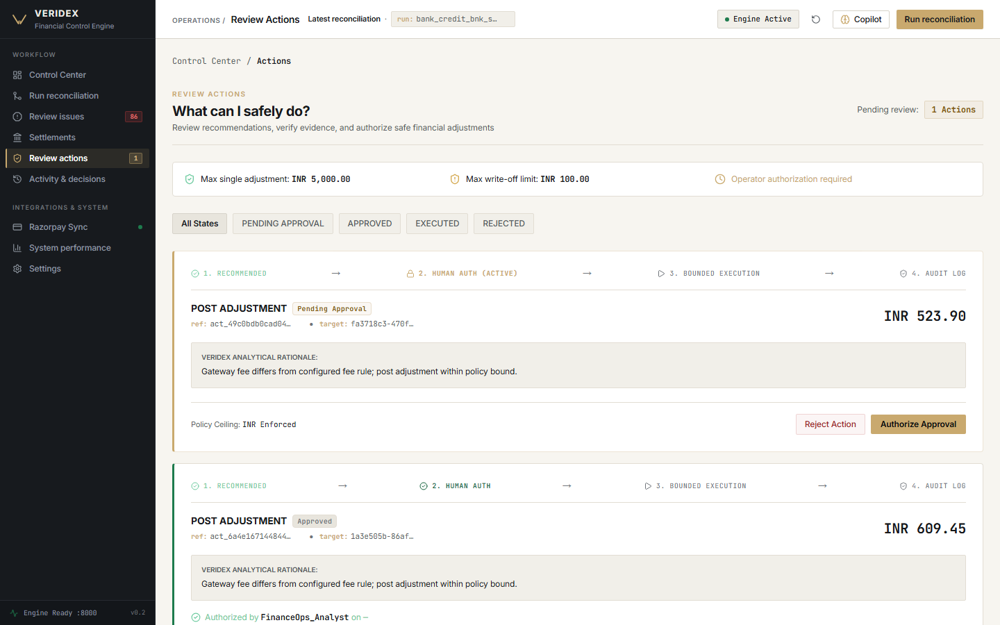
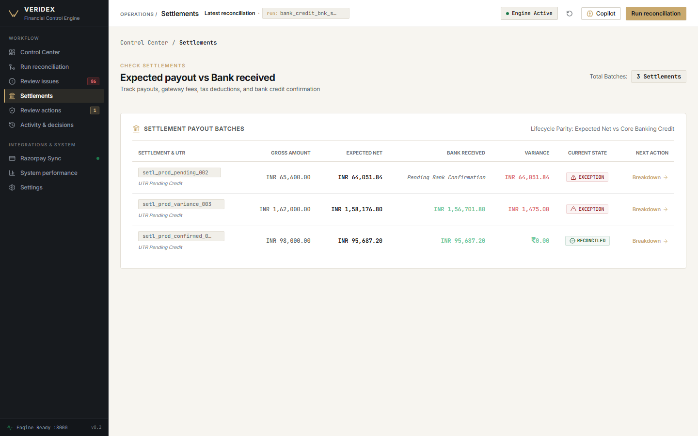
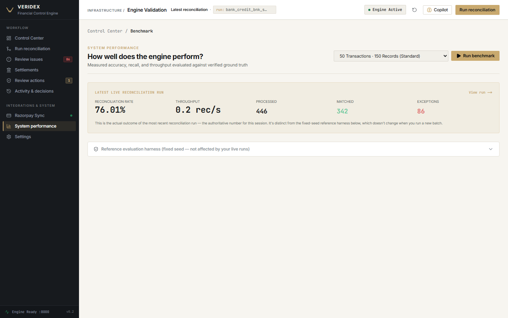
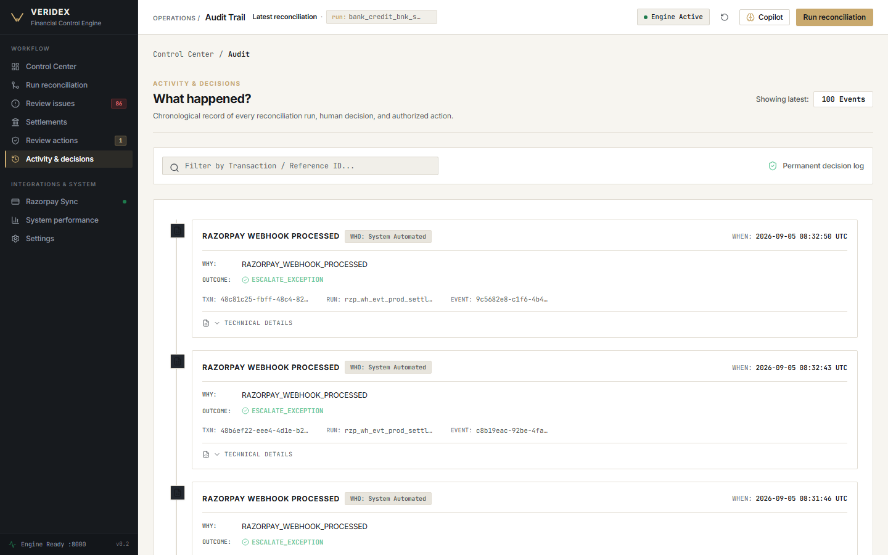
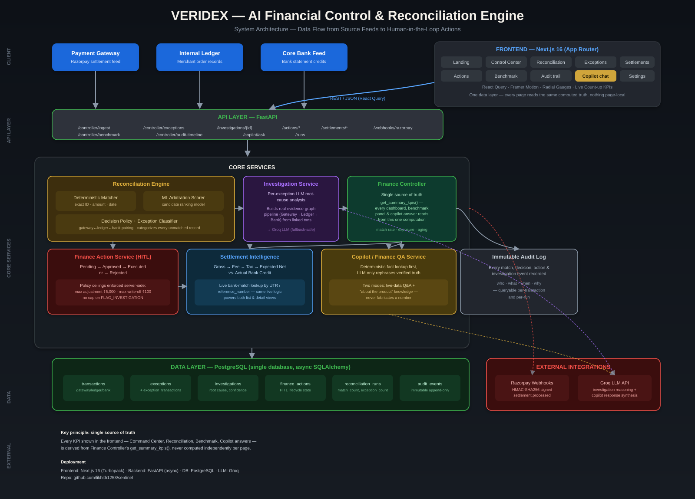

<div align="center">

# 🛡️ VERIDEX
### AI Financial Control & Reconciliation Engine

*"Find the discrepancy. Prove the cause. Control the action."*

[](https://veridex-three.vercel.app)
[](https://veridex-378i.onrender.com/health)
[](#-demo-video)


</div>

---

Every payments company reconciles three fragmented records of the same
transaction — what the **payment gateway** processed, what the **internal
ledger** recorded, and what the **bank statement** actually confirms. They
don't always agree. VERIDEX matches all three automatically, finds exactly
which leg broke when they disagree, explains *why* with real evidence — not
a guess — and never moves money without a human saying yes.

## 🔗 Quick links

| | |
|---|---|
| 🚀 **Live app** | [veridex-three.vercel.app](https://veridex-three.vercel.app) |
| ⚙️ **API** | [veridex-378i.onrender.com](https://veridex-378i.onrender.com/health) &middot; [docs](https://veridex-378i.onrender.com/docs) |
| 🎬 **Demo video** | see [Demo Video](#-demo-video) below |
| 🏗️ **Architecture** | [ARCHITECTURE.md](ARCHITECTURE.md) &middot; [diagram](docs/architecture-diagram.svg) |
| 🔍 **Real bugs found & fixed while deploying** | [docs/ENGINEERING_JOURNAL.md](docs/ENGINEERING_JOURNAL.md) |

> **A note on the live links:** both the frontend and backend run on free
> tiers. Render's free tier sleeps after inactivity and can take 30-60s to
> wake up on the first request — that's hosting, not the app. Give it a
> moment on first load.

## 🎬 Demo video

> _Link goes here — a 5-minute walkthrough covering the full reconciliation
> flow, exception evidence pipeline, human-in-the-loop actions, settlement
> intelligence, and the Copilot assistant._

## 📸 Screenshots

<table>
<tr>
<td width="50%"><br/><sub align="center">Landing page</sub></td>
<td width="50%"><br/><sub>Control Center</sub></td>
</tr>
<tr>
<td width="50%"><br/><sub>Reconciliation — live match rate, throughput, exception breakdown</sub></td>
<td width="50%"><br/><sub>Exception queue with real root-cause categories</sub></td>
</tr>
<tr>
<td width="50%"><br/><sub>Human-in-the-loop action approval workflow</sub></td>
<td width="50%"><br/><sub>Settlement intelligence — expected vs. actual bank credit</sub></td>
</tr>
<tr>
<td width="50%"><br/><sub>Live run metrics vs. the fixed evaluation harness</sub></td>
<td width="50%"><br/><sub>Immutable audit trail of every decision</sub></td>
</tr>
</table>

## ✨ What it does

1. 🔄 **Reconciles** Gateway, Ledger, and Bank records three ways: deterministic exact-match rules first, then an ML arbitration model for the harder ambiguous cases.
2. 🏷️ **Classifies every exception** by real root cause (missing source, timing lag, fee mismatch, tax mismatch, duplicate, amount mismatch) instead of a generic "unresolved" bucket.
3. 🕵️ **Investigates automatically** — a per-exception LLM-assisted investigation reads the actual linked transaction evidence and writes a grounded root-cause explanation, visualized as a real Gateway → Ledger → Bank evidence pipeline showing exactly which leg broke.
4. 💰 **Tracks settlement intelligence** — matches what the gateway says it settled against what actually landed in the bank account, accounting for fees and taxes.
5. 🔐 **Keeps humans in control** — every corrective action (post an adjustment, write off a discrepancy, flag for investigation) goes through a policy-gated human approval workflow with hard ceilings enforced server-side, and a full immutable audit trail.
6. 💬 **Answers questions directly** — a Copilot assistant that computes real answers from the live database first and only uses an LLM to phrase the response, plus a separate "how does this product work" knowledge mode.
7. 📊 **Evaluates itself honestly** — a protected, seed-based benchmark harness scores the reconciliation engine against ground truth, kept fully separate from live usage numbers, and clearly labeled as such in the UI.

## 🧠 Why this is built the way it is

- **Single source of truth.** Every number, on every page, is computed once
  (`FinanceController.get_summary_kpis()`) and read everywhere else — never
  recomputed independently per page. See the journal for what happens
  without this discipline.
- **Deterministic → ML → LLM, in that order.** The expensive, harder-to-verify
  step (LLM investigation) only runs for exceptions that survive the two
  cheaper, fully-explainable stages first.
- **Humans authorize, machines never execute.** Policy ceilings are enforced
  in the database layer, not just displayed as a UI suggestion.
- **Tested against real infrastructure, not just localhost.** Every bug in
  [ENGINEERING_JOURNAL.md](docs/ENGINEERING_JOURNAL.md) was found by
  exercising the actual deployed Neon + Render + Vercel stack — cold starts,
  connection poolers, function timeouts included — because that's the
  environment real users and evaluators actually touch.

## 🏗️ Architecture

- Deterministic matching
- ML candidate scoring
- Selective LLM judgment (Groq)
- Investigation service with real evidence-graph construction
- Root-cause classification
- Financial risk / expected-cost calculation
- Human-in-the-loop finance actions with policy ceilings
- Immutable audit trail
- Canonical evaluation harness against private ground truth

<p align="center"></p>

See [ARCHITECTURE.md](ARCHITECTURE.md) for the full detailed system design.

**Tech stack:**

| Layer | Tech |
|---|---|
| Frontend | Next.js 16 (App Router), TypeScript, Tailwind, React Query, Framer Motion |
| Backend | FastAPI (async), SQLAlchemy, Alembic |
| Database | PostgreSQL ([Neon](https://neon.tech)) |
| Matching / ML | scikit-learn, XGBoost |
| Investigation / reasoning | LangGraph, Groq LLM |
| Vector retrieval | Qdrant |
| Hosting | [Vercel](https://vercel.com) (frontend) + [Render](https://render.com) (backend) |

## 🚀 Running locally

**Backend:**
```bash
pip install -r requirements.txt
alembic upgrade head
uvicorn app.api.main:app --reload --port 8000
```

**Frontend:**
```bash
cd frontend
npm install
npm run dev
```

Copy `.env.example` to `.env` and fill in your database URL, Razorpay webhook secret, and Groq API key before starting the backend.

## ☁️ Deploying it yourself

VERIDEX deploys as three independent pieces — a Postgres database, a FastAPI backend, and a Next.js frontend — and is designed to work on each platform's free tier.

<details>
<summary><b>1. Neon (PostgreSQL)</b></summary>

1. Create a project at [neon.tech](https://neon.tech), grab the connection string.
2. Convert its scheme to the async driver and run migrations once:
   ```bash
   DATABASE_URL="postgresql+asyncpg://<user>:<password>@<host>/<db>?sslmode=require" alembic upgrade head
   ```
3. That's it — the backend also runs `alembic upgrade head` automatically on every boot, so schema drift can't silently ship to production again (see [ENGINEERING_JOURNAL.md](docs/ENGINEERING_JOURNAL.md) for why that matters).

> If you're behind a network that blocks outbound port 5432 (some campus/corporate networks do), run the migration from a different network, or let the backend's own startup hook handle it on first deploy.
</details>

<details>
<summary><b>2. Render (backend)</b></summary>

1. New Web Service → connect this repo → root directory blank (repo root).
2. Build command: `pip install -r requirements.txt`
3. Start command: `uvicorn app.api.main:app --host 0.0.0.0 --port $PORT`
4. Environment variables: `DATABASE_URL` (from Neon), `ENVIRONMENT=production`, `PYTHON_VERSION=3.11.9`, `GROQ_API_KEY`, `RAZORPAY_KEY_ID`, `RAZORPAY_KEY_SECRET`, `RAZORPAY_WEBHOOK_SECRET`, `RAZORPAY_MODE=test`.
</details>

<details>
<summary><b>3. Vercel (frontend)</b></summary>

1. Import this repo → set **Root Directory** to `frontend`.
2. Environment variables: `VERIDEX_BACKEND_URL` = your Render URL (no trailing slash). Optionally `VERIDEX_API_KEY` if you set `SENTINEL_API_KEY` on Render.
3. **Do not** set `NEXT_PUBLIC_API_BASE_URL` — the frontend proxies through a server-side route (`/api/proxy`) specifically so the backend URL and API key never reach the browser bundle.
</details>

## 🧪 Testing

```bash
pytest tests/ -q
```
465 tests, run against an isolated database — never against dev or production data.

## 📏 Evaluation

The canonical benchmark (seed-based, reproducible) lives under `eval/` and is scored against `private_ground_truth.json` — completely separate from live usage numbers, and never modified to make a demo look better. Run it via:

```bash
python -m eval.run_evaluation
```

---

<div align="center">

Built for the Razorpay AI Buildathon — Track 4

</div>
