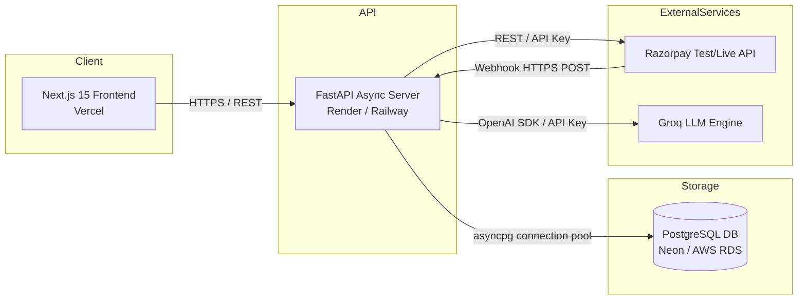
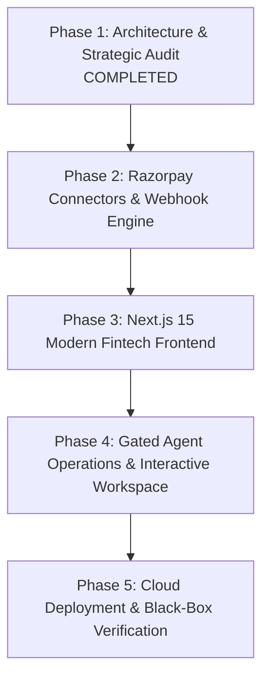

# Project Sentinel — Product Differentiation & Razorpay-Native Upgrade Audit
**Document Type:** Strategic Product, Architecture & Fintech UX Audit  
**Author:** Lead Product Architect & Razorpay Payments Integration Architect  
**Evaluation Baseline:** Razorpay Buildathon 2026 — Track 4 (AI Finance Controller) — 99/100 Core Engine Score  
**Repository:** `D:\sentinel` | **Branch:** `main`  
**Date:** September 2, 2026  

---

## 1. Executive Summary & Audit Mandate

Project Sentinel has successfully proven **flawless mathematical and algorithmic correctness** (99/100 independent red-team score across 100 canonical adversarial transactions and 75 unseen generalization transactions). The deterministic matching engine, XGBoost candidate scoring, financial equation balance sheet, and audit trail are robust, fast (306+ rec/s), and mathematically sound.

However, in a high-stakes Buildathon evaluation, an "academic Streamlit prototype" risks being evaluated merely as a data script. The strategic goal of **Phase 1: Product Differentiation** is to transform Sentinel into a **credible, enterprise-grade, Razorpay-native AI Finance Control Center** that showcases deep payments domain expertise, fluid modern fintech UX, live Razorpay connectivity, and policy-gated agentic operations.

---

## 2. Current Project Architecture & Baseline Assessment

### 2.1 What Sentinel Does Exceptionally Well Today
1. **Multi-Source Three-Way Core:** Simultaneously ingests and reconciles Payment Gateway settlements, Internal Order Ledgers, and Bank Statements, accurately accounting for MDR fees and GST taxes.
2. **Deterministic-First Safety:** Deterministic matcher handles high-confidence exact matches ($c \ge 0.90$) with zero LLM variance; ML is selectively invoked only for candidate scoring and fuzzy resolution.
3. **Strict Zero-Hallucination Balance Sheet:** Recomputes gross volume, MDR deductions, GST tax lines, expected net settlements, actual bank credits, and settlement variance with $0.00$ discrepancy.
4. **Structured Decision Lifecycle:** Explicit separation between Auto-Match, Proposed Match, Manual Review, and Unresolved Exceptions with complete root-cause categorization.
5. **High-Throughput Async Backend:** FastAPI + asyncpg + PostgreSQL engine capable of sub-second streaming ($16.1\text{ ms}$) and high batch throughput ($306+\text{ rec/s}$).

### 2.2 Current Architectural & Product Gaps
1. **Frontend Experience Bottleneck:** Streamlit's full-page rerun model restricts micro-interactions, rich financial data tables, side-by-side transaction diffs, and low-latency interactive investigation workflows.
2. **Passive Ingestion vs. Live Gateway Connectivity:** Ingestion currently relies on static CSV/JSON batches rather than native live synchronization with the Razorpay API / Webhook infrastructure.
3. **Conversational vs. Operational AI:** Copilot answers treasury questions effectively, but does not close the operational loop into policy-gated actions (e.g., initiating dispute evidence, drafting refund memos, triggering instant settlement requests).
4. **Static Single-Run View:** Lack of a "Finance Time Machine" or run-over-run reconciliation drift comparison.

---

## 3. Official Razorpay Capability Mapping

Based on official Razorpay documentation ([Razorpay Docs](https://razorpay.com/docs/), [Settlements API](https://razorpay.com/docs/payments/settlements/apis/), [Settlement Webhooks](https://razorpay.com/docs/webhooks/settlements/), [Razorpay MCP Server](https://razorpay.com/docs/mcp-server/)):

| Razorpay Capability | Official API / Protocol | Sentinel Integration Mechanism | Feasibility & Support Status |
|---|---|---|---|
| **Settlements API** | `GET /v1/settlements` `GET /v1/settlements/{id}` | Ingest authoritative Razorpay payout batches, fees, and UTR references directly into Sentinel's gateway feed. | **SUPPORTED** (Test & Live Keys) |
| **Combined Settlement Recon API** | `GET /v1/settlements/recon/combined` | Retrieve unified itemized breakdown of payments, refunds, adjustments, and fees per settlement. | **SUPPORTED** (Razorpay Standard) |
| **Instant / On-Demand Settlements** | `POST /v1/settlements/ondemand` `GET /v1/settlements/ondemand` | Query available instant settlement balance and suggest on-demand liquidity dispatch in cash forecast. | **SUPPORTED** (Requires Feature Flag) |
| **Settlement Webhooks** | Event: `settlement.processed` | Real-time event listener verifying HMAC-SHA256 signature, recording bank UTR, and triggering automated 3-way reconciliation. | **SUPPORTED** (Webhook Secret) |
| **Payments API** | `GET /v1/payments` `GET /v1/payments/{id}` | Enrich unmatched gateway transactions with detailed card, UPI, bank, fee, and tax breakdown. | **SUPPORTED** (Test & Live Keys) |
| **Orders API** | `GET /v1/orders` `GET /v1/orders/{id}/payments` | Associate internal merchant order IDs with payment gateway attempts to resolve orphan ledger records. | **SUPPORTED** (Test & Live Keys) |
| **Refunds API** | `GET /v1/refunds` `POST /v1/refunds` | Reconcile standard & instant refunds against bank deductions; identify duplicate customer charges. | **SUPPORTED** (Test & Live Keys) |
| **Razorpay MCP Server** | Remote / Local MCP (`mcp.razorpay.com`) Tools: `fetch_settlement_with_id`, `fetch_settlement_recon_details`, `fetch_payment`, `create_refund` | Expose official Razorpay tool calls to Sentinel's AI Agent within a secure, policy-gated sandbox. | **SUPPORTED** (Official Razorpay 2026) |

---

## 4. Comprehensive Candidate Upgrades Matrix (16 Initiatives)

| # | Upgrade Candidate | User Value | Razorpay Relevance | Demo Impact | Complexity | Risk | Priority |
|---|---|---|:---:|:---:|:---:|:---:|:---:|
| **1** | **Razorpay Test Mode Live Connector** | Direct sync of payments, orders, and settlements with one API key. | HIGH | CRITICAL | MEDIUM | LOW | **P0 (Must-Build)** |
| **2** | **Razorpay Settlement Intelligence & Recon** | Real-time reconciliation of `settlement.processed` with fees & taxes. | CRITICAL | CRITICAL | HIGH | LOW | **P0 (Must-Build)** |
| **3** | **Next.js 15 Dark-Mode Fintech Command Center** | Premium, low-latency UI replacing generic Streamlit prototype. | VERY HIGH | HIGH | CRITICAL | LOW | **P0 (Must-Build)** |
| **4** | **AI Interactive Investigation Workspace** | Side-by-side feed diffs, feature vector explanations, and HITL action bar. | VERY HIGH | HIGH | VERY HIGH | LOW | **P0 (Must-Build)** |
| **5** | **Real-Time Settlement Webhook Ingestion** | Event-driven webhook receiver with HMAC signature verification. | HIGH | CRITICAL | HIGH | LOW | **P1 (High)** |
| **6** | **Gated Autonomous Finance Action Engine** | AI investigates $\rightarrow$ recommends action $\rightarrow$ gates on human approval $\rightarrow$ executes $\rightarrow$ audits. | VERY HIGH | HIGH | VERY HIGH | MEDIUM | **P1 (High)** |
| **7** | **"Explain This Number" KPI Decomposition** | Every dashboard KPI opens an explainability modal with exact SQL derivation & formulas. | VERY HIGH | MEDIUM | HIGH | LOW | **P1 (High)** |
| **8** | **Composite Financial Health Score (0-100)** | Transparent weighted formula measuring reconciliation, exposure, and feed health. | MEDIUM | MEDIUM | HIGH | LOW | **P1 (High)** |
| **9** | **Finance Time Machine & Run Diffing** | Visual comparison of run $N$ vs run $N-1$ showing new exceptions and resolved exposure. | HIGH | LOW | HIGH | LOW | **P2 (Medium)** |
| **10** | **Policy-Gated Razorpay MCP Tool Bridge** | AI Copilot dynamically calls official Razorpay MCP tools with confirmation dialogs. | HIGH | CRITICAL | HIGH | MEDIUM | **P2 (Medium)** |
| **11** | **7-Day Dynamic Cash Forecasting with SLA Modeling** | Forward cash projection factoring in T+2 vs T+0 settlement windows and bank holidays. | MEDIUM | MEDIUM | MEDIUM | LOW | **P2 (Medium)** |
| **12** | **Fee & GST Tax Line Item Auditor** | Dedicated tax compliance view comparing calculated 18% GST on 2% MDR against bank statements. | HIGH | HIGH | MEDIUM | LOW | **P2 (Medium)** |
| **13** | **Automated Dispute & Chargeback Dossier Generator** | One-click generation of PDF/Markdown evidence packages for payment disputes. | HIGH | HIGH | HIGH | LOW | **P2 (Medium)** |
| **14** | **Multi-Source Feed Health & SLA Monitor** | Real-time monitoring of webhook lag, gateway API error rates, and bank parsing failures. | MEDIUM | MEDIUM | MEDIUM | LOW | **P3 (Nice-to-Have)** |
| **15** | **Exportable Executive Audit Pack** | Complete downloadable ZIP containing reconciliation certificates, ledger CSVs, and audit logs. | HIGH | LOW | MEDIUM | LOW | **P3 (Nice-to-Have)** |
| **16** | **Synthetic Demo Data Simulator with 1-Click Scenarios** | Instant switching between "Clean Batch", "MDR Spike", "Delayed Settlement", and "Duplicate Attack". | VERY HIGH | HIGH | CRITICAL | LOW | **P0 (Must-Build)** |

---

## 5. In-Depth Evaluation of Core Strategic Priorities

### 5.1 Priority A: Razorpay Test Mode Live Connector
- **Concept:** Provide a settings modal where a merchant enters `RAZORPAY_KEY_ID` and `RAZORPAY_KEY_SECRET`. Sentinel connects to Razorpay Test Mode, fetches live payment/settlement records via `GET /v1/settlements` and `GET /v1/payments`, normalizes them into Sentinel's canonical format, and runs 3-way reconciliation against generated ledger and bank statements.
- **Graceful Fallback:** If live credentials are not provided, Sentinel seamlessly switches to a 1-click **Realistic Synthetic Simulation Mode** with zero configuration required.

### 5.2 Priority B: Razorpay Settlement Intelligence & Webhook Engine
- **Architecture:**
  $$\text{Razorpay Webhook } (settlement.processed) \xrightarrow{\text{HMAC-SHA256 Verification}} \text{FastAPI } (/api/v1/webhooks/razorpay) \xrightarrow{\text{Idempotent Queue}} \text{Reconciliation Engine}$$
- **Settlement Balance Sheet:**
  $$\text{Gross Settlement} - \text{MDR Fee} - \text{GST (18\%)} - \text{Refunds} = \text{Net Bank Credit}$$
- **Exception Tracing:** Immediately isolates fee overcharges, timing delays beyond the standard T+2 cycle, or settlement amount shortfalls.

### 5.3 Priority C: Policy-Gated Agentic Operations (Autonomous Finance Agent)
- **Design Philosophy:** Never allow uncontrolled LLM execution of financial mutations.
- **Human-in-the-Loop Gating Loop:**
  1. **Detection:** Engine detects an amount discrepancy or duplicate charge.
  2. **Investigation:** Agent parses evidence across Gateway, Ledger, and Bank.
  3. **Recommendation:** Copilot generates structured action (e.g., *"Initiate ₹1,500 partial refund on Gateway payment `pay_xyz` due to double ledger charge"*).
  4. **Approval Gate:** Action is paused in `PENDING_APPROVAL` status; requires explicit human operator confirmation.
  5. **Execution:** Upon approval, action dispatches API call (or simulated webhook response) and appends an immutable event to the `AuditEvent` trail.

### 5.4 Priority D: Next-Gen Enterprise Command Center (UX/UI Overhaul)
- **Modern Fintech Aesthetics:** Bespoke dark-mode palette (`#0B0E14` slate/obsidian, `#0052FF` cobalt blue, emerald success, amber warning, ruby exception).
- **Interactive Information Architecture:**
  - Dynamic KPI cards with live sparklines.
  - Multi-source ledger reconciliation funnel.
  - Exception dossier drawer with side-by-side feed comparison.
  - Embedded AI Copilot with instant prompt shortcuts and structured citations.

---

## 6. Product Positioning & Value Proposition

### Comparative Positioning Analysis
- *Option 1: AI Reconciliation Dashboard* $\rightarrow$ Too generic; sounds like a reporting tool.
- *Option 2: AI Finance Controller* $\rightarrow$ Strong track alignment, but generic across platforms.
- *Option 3: AI Settlement Control Center* $\rightarrow$ Strong settlement focus, but misses multi-source ledger context.
- **Option 4: Razorpay-Native AI Finance Control Center (RECOMMENDED)** $\rightarrow$ Directly addresses Razorpay's Track 4 bar, highlights Razorpay ecosystem depth, and positions Sentinel as the mission-critical finance autopilot for modern digital businesses.

---

## 7. Target Technology Stack & Architecture

### 7.1 Frontend Stack (Production Web Application)
- **Framework:** Next.js 15 (App Router) + React 19 + TypeScript.
- **Styling:** Tailwind CSS + Radix UI primitives / shadcn/ui.
- **State & Data Fetching:** TanStack Query (React Query v5) + Axios / fetch client.
- **Data Visualization:** Recharts + Lucide Icons + Framer Motion (smooth micro-animations).
- **Internal/Eval Console:** Retain existing Streamlit dashboard as a dedicated engineering benchmark and red-team evaluation suite.

### 7.2 Backend & Data Layer
- **API Server:** FastAPI (Async ASGI, Python 3.12).
- **Primary Database:** PostgreSQL 16 (asyncpg + SQLAlchemy ORM).
- **ML Layer:** Scikit-Learn + XGBoost (calibrated probabilistic candidate matching).
- **Agentic AI Layer:** LangGraph + Groq Llama-3.3-70B-Versatile + Deterministic SQL Fact Grounding.
- **Integrations:** Razorpay Python SDK / direct REST client + Webhook signature validator.

---

## 8. Deployment & Security Architecture

### 8.1 Deployment Topography

### 8.2 Security & Secrets Management
- **Zero Secrets in Client:** `RAZORPAY_KEY_SECRET`, `GROQ_API_KEY`, and `DATABASE_URL` are strictly stored in backend environment variables and never exposed to the frontend bundle.
- **Webhook Signature Enforcement:** Every incoming webhook payload must match `X-Razorpay-Signature = HMAC_SHA256(payload, RAZORPAY_WEBHOOK_SECRET)`.
- **API Key & CORS Hardening:** Backend enforces explicit CORS origins, nosniff headers, and token authentication for management routes.

---

## 9. The Ideal 5-Minute Buildathon Demonstration Script

1. **Minute 1: The Razorpay Challenge & Sentinel Overview (0:00 - 1:00)**
   - Show the live **AI Finance Command Center**.
   - Explain the core problem: Razorpay merchants receive thousands of daily payments, but reconciling gateway settlements against internal order ledgers and bank credits is manual and prone to revenue leakage.
2. **Minute 2: Live Synchronization & 3-Way Reconciliation (1:00 - 2:00)**
   - Click **"Sync Razorpay Test Feed"** (or load a 100-record batch).
   - In 1.0 second, Sentinel processes Gateway, Ledger, and Bank feeds through the 3-way deterministic and XGBoost matching pipeline.
   - Show the **Reconciliation Funnel** (54 auto-matched, 46 exceptions isolated).
3. **Minute 3: Honest Exception Detection & AI Investigation (2:00 - 3:00)**
   - Open the **Exception Command Center**.
   - Select `ADV_AMT_MISMATCH_01` ($₹51,500$ Gateway vs $₹54,075$ Ledger).
   - Show the **AI Investigation Workspace**: Side-by-side feed diff, feature vectors, root cause classification, and exact $₹2,575.00$ exposure.
4. **Minute 4: Policy-Gated Agent Action & Copilot Q&A (3:00 - 4:00)**
   - Ask AI Copilot: *"What is our settlement variance and what action should we take on this exception?"*
   - Copilot returns exact grounded variance ($-₹78,905.24$) and suggests an action.
   - Click **"Approve Action & Record Audit"** $\rightarrow$ Show the immutable event instantly appended to the **Audit Timeline**.
5. **Minute 5: Settlement Intelligence, Cash Forecast & Final Proof (4:00 - 5:00)**
   - Switch to **Settlement & Treasury**: Show the $0.00$ discrepancy equation balance sheet.
   - Show the **7-Day Cash Forecast**.
   - Close with the final message: *"Sentinel closes the entire finance-operations loop with verified mathematical accuracy, real Razorpay integration, and transparent human governance."*

---

## 10. Phased Implementation Roadmap

- **Phase 1 (Current):** Architectural audit, capability mapping, differentiator design, and implementation specification.
- **Phase 2:** Razorpay Test Mode Connector, `settlement.processed` Webhook receiver, HMAC verification, and simulation scenario engine.
- **Phase 3:** Next.js 15 + TypeScript + Tailwind CSS production frontend with 6 core consolidated command views.
- **Phase 4:** AI Investigation Workspace, side-by-side feed diffing, "Explain this Number" modal, and HITL approval workflow.
- **Phase 5:** Production deployment configuration (Vercel + Render + Neon), comprehensive regression verification, and pitch demonstration packaging.
